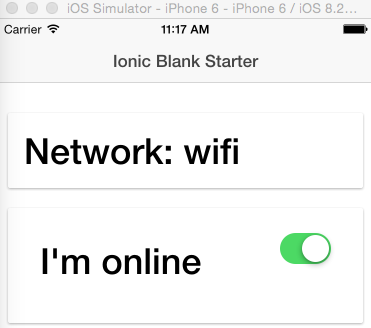

# IonicNetworkInfo

Tutorial on how to recreate this application step by step can be found on my blog: [http://www.nikola-breznjak.com/blog/codeproject/check-network-information-change-with-ionic-famework/](http://www.nikola-breznjak.com/blog/codeproject/check-network-information-change-with-ionic-famework/).
